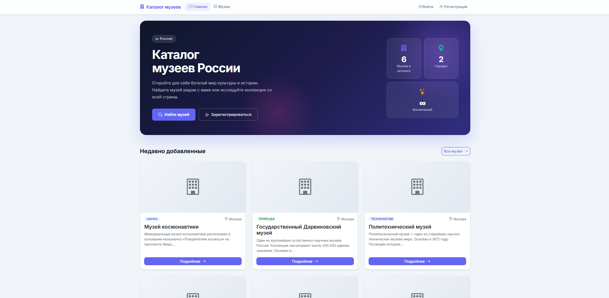

# Museum Catalog 🏛️

Дипломный проект — веб-приложение «Каталог музеев»: просмотр музеев, регистрация
пользователей, подача заявок на добавление музея и админ-панель для модерации.



## Технологии
- **Backend:** Python, Flask
- **БД / ORM:** SQLAlchemy (SQLite локально, PostgreSQL на проде через `DATABASE_URL`)
- **Аутентификация:** Flask-Login + Flask-Bcrypt
- **Формы:** Flask-WTF / WTForms (с CSRF)
- **Шаблоны:** Jinja2
- **Деплой:** Render (gunicorn), конфиг в `render.yaml`

## Структура
```
app/
├── main/       — публичные страницы (каталог, карточки музеев)
├── auth/       — регистрация и вход
├── admin/      — админ-панель (модерация музеев и заявок)
├── templates/  — Jinja2-шаблоны
└── static/     — CSS, JS, загруженные изображения
config.py       — конфигурация
run.py          — инициализация БД и создание администратора
seed_museums.py — наполнение базы тестовыми музеями
wsgi.py         — точка входа для gunicorn
```

## Запуск локально
```bash
python -m venv .venv
.venv\Scripts\activate        # Windows
pip install -r requirements.txt
python run.py                 # создаст БД, админа и тестовые данные
flask run                     # или: gunicorn wsgi:app
```
Приложение будет доступно на http://127.0.0.1:5000

## Переменные окружения
| Переменная     | Назначение                                  |
|----------------|---------------------------------------------|
| `SECRET_KEY`   | Секретный ключ Flask (подпись сессий)       |
| `DATABASE_URL` | Строка подключения к БД (PostgreSQL на проде)|

> На проде обязательно задавайте `SECRET_KEY` через переменную окружения —
> не полагайтесь на значение по умолчанию.
